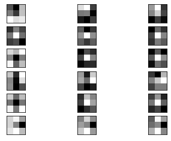
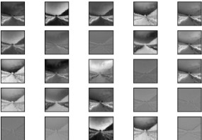

# Ofogh_interview_project
- [شرح پروژه](#شرح_پروژه)
- [مدل مورد استفاده](مدل_مورد_استفاده)
- [بررسی فیلتر ها](#بررسی_فیلتر_ها)
- [بررسی خروجی لایه های میانی](#بررسی_خروجی_لایه_های_میانی)
## شرح پروژه 
امروزه شبکه های کانولوشنی در کاربردهای زیادی مورد استفاده قرار میگیرند. درک نحوه های کارکرد این شبکه های به شناخت مولفه های تشکیل دهنده ی آن وابسته است.
لایه های میانی که واحد های پردازنده شبکه های کانولوشنی میباشند پیکره ی اصلی این شبکه ها را تشکیل میدهند. فیلتر های هر لایه مشخصه هایی از تصویر ورودی و یا خروجی لایه قبل استخراج میکند که به تصویر کشیدن این فیلتر ها باعث شناخت این مشخصه ها میشود. در واقع تصویر که به عنوان ورودی شبکه است دو بعدی است و این دو بعد دارای ارتباط مکانی میباشد, فیلتر های هر لایه در پی یافتن این ارتباط میان ابعاد میباشند.
از طرف دیگر خروجی هر لایه تصاویری است که پس از اعمال فیلتر ها حاصل میشود, به تصویر گشیدن این تصاویر نیز درک خوبی از چگونگی تاثیر گذاشتن فیلتر های هر لایه حاصل میکند.
## مدل مورد استفاده
در این پروژه از مدل آموزش دیده شده ی inception_v3 از کتاب خانه کراس استفاده شده است, اسن مدل بر روی دیتاست ImageNet آموزش دیده شد است.
این مدل لایه های زیادی دارد که در میان آنها انواع لایه های کانولوشنی و پولینگ حصور دارند و برای اهداف این پروژه مناسب است.

## بررسی فیلتر ها
همان طور که بیان شد فیلر ها به منظور شناخط ارتباط میان ابعاد تصویر ورودی اعمال میشوند. مشخص است که ابعاد این فیلتر ها نیز با یکدیگر در ارتباط میباشند و نمایش دو بعدی ابعاد ویژگی های یک فیلتر را مشخص میکتد.
عمق ماتریس فیلتر های هر لایه میبایست با عمق تصویر ورودی متنایب باشد, با نوجه به رنگی بودن تصویر ورودی میتوان یک فیلتر به ازای سه کانال رنگی در نظر گرفت و یا متناظر با هر کانال رنگی یک فیلتر در نظر گرفت.
شکل زیر شش فیلتر ابتدایی لایه اول را نمایش میدهد, هر ستون برای یک کانال رنگی میباشد.

همان طور که در شکل مشخص است در برخی موارد مانند فیلتر شماره شش فیلتر های هر کانال رنگی مشابه یکدیگر بوده و در برخی موارد مانند فیلتر شماره یک فیلتر ها با یکدیگر متفاوتند.
مربع های با رنگ روشن به معنای تاثیر گذاری زیاد در ورودی و مربع عای با رنگ تیره به معنای تاثیر گذاری کم میباشد.

## بررسی خروجی لایه های میانی
با بررسی مقادیر خروجی لایه های میانی مشخصه های استخراج شده توسط فیلتر های لایه ها قابل مشاهده میگردند. 
لایه های ابتدایی نزدیک به تصویر ورودی مشخصه های ساده و یا به نوعی اطلاعات اولیه مانند لبه های تصویر و یا اشکال موجود در تصویر را استخراج کرده و لایه های انتهایی ویژگی های سطح بالاتر مانند موجودیت های موجود در تصویر را مشخص میکنند.
در این پروژه دو رویکرد برای بع تصویر کشیدن مقادیر خروجی لایه های میانی در نظر گرفته میشود.
ر رویکرد اول یک مدل با استفاده از اظافه کردن لایه های مدل آموزش دیده ایجاد گردیده و خروجی این مدل بر تصویر ورودی نمایش داده میشود.
در تصویر زیر خروجی لایه اول نمایش داده میشود, تصاویر بدست امده در واقع نمونه هایی از تصویر ورودی میباشند که در هر کدام ویژگی مشخصی استخراج گردیده است.

رویکرد بعدی به این صورت است که مدل آموزش دیده شده به بلاک هایی تقسیم میشود و در یک گام خروجی های هر بلاک نمایش داده میشود. این بلاک ها تعدادی لایه از مدل آموزش دیده شده میباشند و وزن های آموزش دیده نیز در لایه ها ذخیره گردیده اند.
شکل زیر خروجی تعدادی از این بلاک ها را نمایش میدهد.

.png)

.png)

.png)

.png)

.png)
